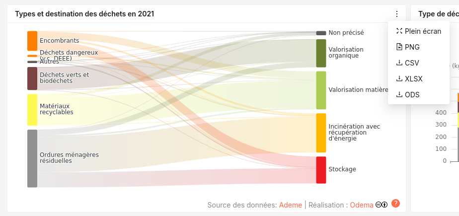

# DashboardElement

Le composant [DashboardElement](src/components/dashboard_element/index.tsx) peut-être utilisé pour ajouter des fonctionnalités à un _element_ (graphique ou cartographique) de tableau de bord.
Il ajoute :
- Une _card_ servant de conteneur, avec titre, crédit et licences.
- Un menu contextuel permettant à l'utilisateur de :
    - Afficher le contenu en plein écran
    - Exporter le contenu en format image (png)
    - Exporter les données (csv, xlsx, ods)
- Un gestion du chargement de données et des données non disponibles
- Une possibilité d'écrire une note méthodologique

Pour fonctionner correctement, le composant enfant doit exporter la référence de l'élément graphique (_echart_ ou _maplibre_) à l'aide du hook `useDashboardElement`.



## Propriétés

- `title` : Titre de l'élément
- `attributions` : Crédits, sous la forme `[{name: 'Source 1', url: 'url1'}, {name: 'Source 2', url: 'url2'},{...}]`
- `description` : Description et notes méthodo. Il s'agit d'un texte brut ou formaté (avec balises HTML).
- `isFetching` : Booléen qui indique si les données sont en train d'être télécharger (floute le graphique si le chargement dépasse les 500ms)
- `toolbox` : Booléen pour afficher/masquer le menu contextuel permettant l'affichage plein écran et les exports de données/images
- `fullscreen` : Booléen pour autoriser le mode plein-écran
- `exportPNG` : Booléen pour autoriser l'export en format image
- `exportData` : Booléen pour autoriser l'export de données
- `Licenses` : Les licences appliquées au graphique (exemple : ['CC','SA']). Par défaut ['CC','BY'].


## Données du graphique

Les données proposées au téléchargement à l'utilisateur sont à définir dans le hook `useExportData`. Si, pour un graphique, les données sont susceptibles de changer, on passera les variables qui déclanchent ce changement dans le paramètre `dependencies`.
L'utilisateur peut télécharger les données en _csv_, _ods_ ou _xlsx_.

Il est possible de désactiver l'export de données en passant le paramètre `exportData=False` au composant `DashboardElement`.
Si le tableau passé en paramètre est vide, le composant affichera alors une information "Pas de données disponibles".

Exemple :
```typescript
    useChartData({data:data_chart}) //Si datachart est un tableau vide, le graphique est masqué et remplacé par un affichage "Pas de données".
```


## Export en image :

Les cartes et graphiques peuvent être exportées en PNG.
Il est possible de désactiver l'export d'image en passant le paramètre `exportPNG=False` au composant `DashboardElement`.


```typescript
export const MapIsdnd: React.FC<IMapProps> = ({ data, style }) => {
  const mapRef = useRef<any>(null);
  useDashboardElement({chartRef:mapRef})
  [...]
  return (
    <Map
      reuseMaps
      preserveDrawingBuffer={true}
      ref={mapRef}
      style={style} [...]/>
    )
}
```
Pour les cartes, la propriété `preserveDrawingBuffer={true}` est nécessaire pour permettre l'export PNG (sinon, le fichier exporté sera blanc).

```typescript
export const ChartIsdndGlobal: React.FC<IChartIsdndGlobalProps> = ({ data, style}) => {
    const chartRef = useRef<any>();
    useDashboardElement({chartRef})
    [...]
    return (
        <ReactECharts
        option={option} ref={chartRef} style={style} />
    )
}
```

## Plein-écran :

Il est possible de désactiver l'affichage en plein écran en passant le paramètre `fullscreen=False` au composant `DashboardElement`.