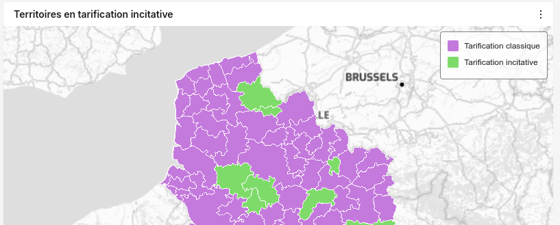

# MapLegend

Ce composant permet de mettre en forme une légende cartographique. 
Utilisez le _hook_ [useMapControl](../../utils/README.MD) pour ajouter la légende à la carte.



Exemple : 
```tsx

const colors = {incitative:"#7EDB69", classique:"#C479DC"}

const legendItems:LegendItem[] = [
    { color: colors.classique, label: 'Tarification classique' },
    { color: colors.incitative, label: 'Tarification incitative' }
];

export const MapTI: React.FC<IMapTIProps> = ({ style }) => {
    const mapRef = useRef<any>(null);

    useDashboardElement({chartRef:mapRef});
    useMapControl({mapRef, legendElement:<MapLegend items={legendItems}/>})
    /* ... */

    return (
          <Map
      reuseMaps
      preserveDrawingBuffer
      ref={mapRef} // Référence de la carte pour le hook useMapControl  
    >
    {/* Sources, layers, etc.. */}
    </map>
    )
}
```