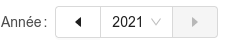

# NextPrevSelect

Il s'agit d'un [Select](https://ant.design/components/select) bordé de 2 boutons 
permettant de sélectionner l'élément précédent ou suivant.

Dans les tableaux de bord, il est surtout utilisé pour perrmettre à l'utilisateur de choisir l'année, 
mais peut être fonctionné avec n'importe quelle liste d'éléments.

Utilisez la propriété `reverse: boolean` pour modifier le comportement (le bouton suivant permet de descendre dans la liste, ou inversement)

